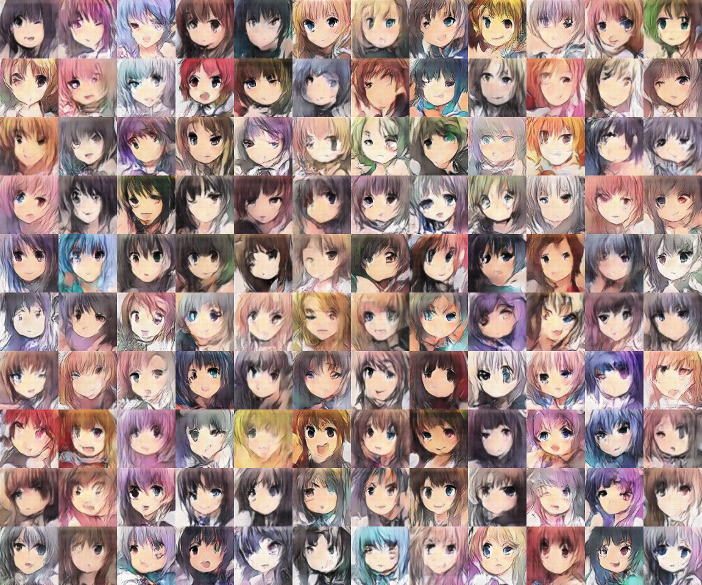
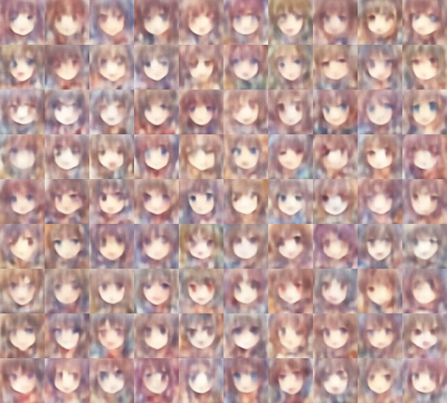

# ganimu

Generating anime faces with deep convolution neural networks.

## Generating with a GAN network

Montage of 120 faces generated by a GAN. The model was trained for 71 epochs and the results are pretty cute!

An interactive web demo lies [here](https://fw.neocities.org/ganime.html).

## Generating with a VAE network

Montage of 90 faces generated by a [VAEGAN](https://arxiv.org/pdf/1512.09300.pdf). It's a lot blurrier than GAN, possibly due to the high weight of the L2 reconstruction loss. Due to performance and memory constraints I wasn't able to test this for long, however, feel free to try tuning the hyperparameters.

